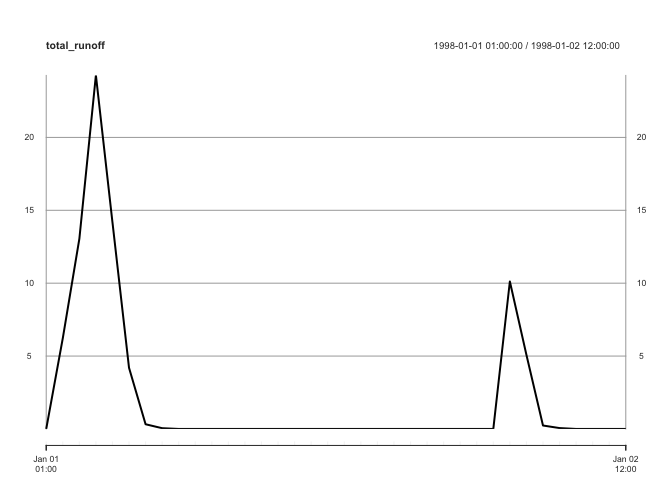

<!-- README.md is generated from README.Rmd. Please edit that file -->
swmmr
=====

[](https://cran.r-project.org/package=swmmr) [](https://travis-ci.org/dleutnant/swmmr)

Functions to connect the widely used [Storm Water Management Model (SWMM)](https://www.epa.gov/water-research/storm-water-management-model-swmm) of the United States Environmental Protection Agency (US EPA) to R with currently two main goals: (1) Run a SWMM simulation from R and (2) provide fast access to simulation results, i.e. SWMM's binary '.out'-files. High performance is achieved with help of Rcpp. Additionally, reading SWMM's '.inp'-files is supported to glance model structures.

Installation
------------

Installation is easy thanks to CRAN:

``` r
install.packages("swmmr")
```

You can install the dev version from github with:

``` r
# install.packages("devtools")
devtools::install_github("dleutnant/swmmr@dev")
```

Example
-------

This is a basic example which shows you how to work with the package. We use the example shipped with the SWMM5 executable.

``` r

library(swmmr)
library(purrr) # to conveniently work with list objects

# set path to inp (avoid white spaces in file paths!)
inp_path <- "~/EPA_SWMM_Projects/Examples/Example1.inp"

# glance model structure, the result is a list of data.frames with SWMM sections
inp <- read_inp(inp = inp_path)

# available SWMM sections
summary(inp)
#>               Length Class      Mode
#> title         2      data.frame list
#> options       2      data.frame list
#> raingages     6      data.frame list
#> subcatchments 8      data.frame list
#> subareas      7      data.frame list
#> infiltration  5      data.frame list
#> junctions     6      data.frame list
#> outfalls      4      data.frame list
#> conduits      8      data.frame list
#> xsections     7      data.frame list
#> pollutants    9      data.frame list
#> landuses      1      data.frame list
#> coverages     3      data.frame list
#> loadings      6      data.frame list
#> buildup       7      data.frame list
#> washoff       7      data.frame list
#> timeseries    3      data.frame list
#> report        2      data.frame list
#> tags          6      data.frame list
#> coordinates   3      data.frame list
#> vertices      3      data.frame list
#> polygons      3      data.frame list
#> symbols       3      data.frame list
#> backdrop      5      data.frame list

# for example, inspect section TIMESERIES
inp$TIMESERIES
#> NULL

# run a simulation
# the result is a named list of paths, directing
# to the inp, rpt and out-file, respectively.
files <- run_swmm(inp = inp_path)
#> arguments 'minimized' and 'invisible' are for Windows only

# we can now read model results from the binary output:
# here, we focus on the system variable (iType = 3) from which we pull
# total rainfall (in/hr or mm/hr) and total runoff (flow units) (vIndex = c(1,4)).
results <- read_out(files$out, iType = 3, vIndex = c(1, 4))
#> Warning in strptime(xx, f <- "%Y-%m-%d %H:%M:%OS", tz = tz): unknown
#> timezone 'default/Europe/Berlin'

# results is a list object containing two time series 
str(results, max.level = 2)
#> List of 1
#>  $ system_variable:List of 2
#>   ..$ total_rainfall:An 'xts' object on 1998-01-01 01:00:00/1998-01-02 12:00:00 containing:
#>   Data: num [1:36, 1] 0.25 0.5 0.8 0.4 0.1 ...
#>   Indexed by objects of class: [POSIXct,POSIXt] TZ: GMT
#>   xts Attributes:  
#>  NULL
#>   ..$ total_runoff  :An 'xts' object on 1998-01-01 01:00:00/1998-01-02 12:00:00 containing:
#>   Data: num [1:36, 1] 0 6.22 13.03 24.25 14.17 ...
#>   Indexed by objects of class: [POSIXct,POSIXt] TZ: GMT
#>   xts Attributes:  
#>  NULL

# basic summary
results[[1]] %>% purrr::map(summary)
#> $total_rainfall
#>      Index                        .x[[i]]       
#>  Min.   :1998-01-01 01:00:00   Min.   :0.00000  
#>  1st Qu.:1998-01-01 09:45:00   1st Qu.:0.00000  
#>  Median :1998-01-01 18:30:00   Median :0.00000  
#>  Mean   :1998-01-01 18:30:00   Mean   :0.07361  
#>  3rd Qu.:1998-01-02 03:15:00   3rd Qu.:0.00000  
#>  Max.   :1998-01-02 12:00:00   Max.   :0.80000  
#> 
#> $total_runoff
#>      Index                        .x[[i]]       
#>  Min.   :1998-01-01 01:00:00   Min.   : 0.0000  
#>  1st Qu.:1998-01-01 09:45:00   1st Qu.: 0.0000  
#>  Median :1998-01-01 18:30:00   Median : 0.0000  
#>  Mean   :1998-01-01 18:30:00   Mean   : 2.1592  
#>  3rd Qu.:1998-01-02 03:15:00   3rd Qu.: 0.1033  
#>  Max.   :1998-01-02 12:00:00   Max.   :24.2530

# basic plotting
results[[1]] %>% purrr::imap( ~ plot(.x, main = .y))
#> $total_rainfall
```


    #> 
    #> $total_runoff



Contributions
-------------

This Git repository uses the [Git Flow](http://nvie.com/posts/a-successful-git-branching-model/) branching model (the [`git flow`](https://github.com/petervanderdoes/gitflow-avh) extension is useful for this). The [`dev`](https://github.com/dleutnant/swmmr/tree/dev) branch contains the latest contributions and other code that will appear in the next release, and the [`master`](https://github.com/dleutnant/swmmr) branch contains the code of the latest release, which is exactly what is currently on [CRAN](https://cran.r-project.org/package=swmmr).

Contributing to this package is easy. Just send a [pull request](https://help.github.com/articles/using-pull-requests/). When you send your PR, make sure `dev` is the destination branch on the [swmmr repository](https://github.com/dleutnant/swmmr). Your PR should pass `R CMD check --as-cran`, which will also be checked by <a href="https://travis-ci.org/dleutnant/swmmr">Travis CI</a> when the PR is submitted.

Code of condcut
---------------

Please note that this project is released with a [Contributor Code of Conduct](CONDUCT.md). By participating in this project you agree to abide by its terms.

Acknowledgments
---------------

This package has been developed in the course of the project [STBMOD](https://www.fh-muenster.de/forschung/forschungskatalog/projekt.php?pr_id=722), carried out at the [Institute for Infrastructure, Water, Resources, Environment (IWARU)](https://en.fh-muenster.de/iwaru/index.php) of the [Muenster University of Applied Sciences](https://www.fh-muenster.de). The project was funded by the German Federal Ministry of Education and Research (BMBF, FKZ 03FH033PX2).

The development of the R package was inspired by the work of [Peter Steinberg](https://github.com/PeterDSteinberg/RSWMM). Also, it benefits from Interface Guide of SWMM.
