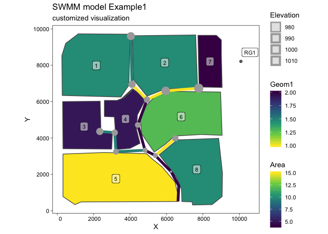

swmmr
================

<!-- README.md is generated from README.Rmd. Please edit that file -->

[](https://cran.r-project.org/package=swmmr)
[](https://travis-ci.org/dleutnant/swmmr)

Functions to connect the widely used [Storm Water Management Model
(SWMM)](https://www.epa.gov/water-research/storm-water-management-model-swmm)
of the United States Environmental Protection Agency (US EPA) to R with
currently two main goals: (1) Run a SWMM simulation from R and (2)
provide fast access to simulation results, i.e. SWMM’s binary
‘.out’-files. High performance is achieved with help of Rcpp.
Additionally, reading SWMM’s ‘.inp’ and ‘.rpt’ files is supported to
glance model structures and to get direct access to simulation
summaries.

## Installation

Installation is easy thanks to CRAN:

``` r
install.packages("swmmr")
```

You can install the dev version from github with:

``` r
# install.packages("remotes")
remotes::install_github("dleutnant/swmmr@dev")
```

## Example

This is a basic example which shows you how to work with the package. We
use the example shipped with the SWMM5 executable.

### Initiate a SWMM run and retrieve simulation results

``` r
library(swmmr)
library(purrr) # to conveniently work with list objects

# set path to inp
# If your operating system is Windows, the Example model files are usually 
# located at "C:\Users\your user name\Documents\EPA SWMM Projects\Examples".
# For convenience the Example1.inp model is also included in the swmmr package.
inp_path <- system.file("extdata", "Example1.inp", package = "swmmr", mustWork = TRUE)

# glance model structure, the result is a list of data.frames with SWMM sections
inp <- read_inp(x = inp_path)
#> Warning: Expected 6 pieces. Additional pieces discarded in 13 rows [1, 2,
#> 3, 4, 5, 6, 7, 8, 9, 10, 11, 12, 13].
#> Warning: Expected 9 pieces. Additional pieces discarded in 13 rows [1, 2,
#> 3, 4, 5, 6, 7, 8, 9, 10, 11, 12, 13].

# show swmm model summary
summary(inp)
#> 
#> ** summary of swmm model structure ** 
#> infiltration   :     horton 
#> flow_units     :        cfs 
#> flow_routing   :    kinwave 
#> start_date     : 01/01/1998 
#> end_date       : 01/02/1998 
#> raingages      :          1 
#> subcatchments  :          8 
#> aquifers       :          0 
#> snowpacks      :          0 
#> junctions      :         13 
#> outfalls       :          1 
#> dividers       :          0 
#> storages       :          0 
#> conduits       :         13 
#> pumps          :          0 
#> orifices       :          0 
#> weirs          :          0 
#> outlets        :          0 
#> controls       :          0 
#> pollutants     :          2 
#> landuses       :          2 
#> lid_controls   :          0 
#> treatment      :          0 
#> *************************************

# for example, inspect section subcatchments
inp$subcatchments
#> # A tibble: 8 x 9
#>   Name  `Rain Gage` Outlet  Area Perc_Imperv Width Perc_Slope CurbLen
#>   <chr> <chr>       <chr>  <int>       <int> <int>      <dbl>   <int>
#> 1 1     RG1         9         10          50   500       0.01       0
#> 2 2     RG1         10        10          50   500       0.01       0
#> 3 3     RG1         13         5          50   500       0.01       0
#> 4 4     RG1         22         5          50   500       0.01       0
#> 5 5     RG1         15        15          50   500       0.01       0
#> 6 6     RG1         23        12          10   500       0.01       0
#> 7 7     RG1         19         4          10   500       0.01       0
#> 8 8     RG1         18        10          10   500       0.01       0
#> # … with 1 more variable: Snowpack <lgl>

# run a simulation
# the result is a named list of paths, directing
# to the inp, rpt and out-file, respectively.
files <- run_swmm(inp = inp_path)
#> arguments 'minimized' and 'invisible' are for Windows only

# we can now read model results from the binary output:
# here, we focus on the system variable (iType = 3) from which we pull
# total rainfall (in/hr or mm/hr) and total runoff (flow units) (vIndex = c(1,4)).
results <- read_out(files$out, iType = 3, vIndex = c(1, 4))

# results is a list object containing two time series 
str(results, max.level = 2)
#> List of 1
#>  $ system_variable:List of 2
#>   ..$ total_rainfall:An 'xts' object on 1998-01-01 01:00:00/1998-01-02 12:00:00 containing:
#>   Data: num [1:36, 1] 0.25 0.5 0.8 0.4 0.1 ...
#>   Indexed by objects of class: [POSIXct,POSIXt] TZ: GMT
#>   xts Attributes:  
#>  NULL
#>   ..$ total_runoff  :An 'xts' object on 1998-01-01 01:00:00/1998-01-02 12:00:00 containing:
#>   Data: num [1:36, 1] 0 6.22 13.03 24.25 14.17 ...
#>   Indexed by objects of class: [POSIXct,POSIXt] TZ: GMT
#>   xts Attributes:  
#>  NULL

# basic summary
results[[1]] %>% invoke(merge, .) %>% summary
#>      Index                     total_rainfall     total_runoff    
#>  Min.   :1998-01-01 01:00:00   Min.   :0.00000   Min.   : 0.0000  
#>  1st Qu.:1998-01-01 09:45:00   1st Qu.:0.00000   1st Qu.: 0.0000  
#>  Median :1998-01-01 18:30:00   Median :0.00000   Median : 0.0000  
#>  Mean   :1998-01-01 18:30:00   Mean   :0.07361   Mean   : 2.1592  
#>  3rd Qu.:1998-01-02 03:15:00   3rd Qu.:0.00000   3rd Qu.: 0.1033  
#>  Max.   :1998-01-02 12:00:00   Max.   :0.80000   Max.   :24.2530

# basic plotting
results[[1]] %>% imap( ~ plot(.x, main = .y))
#> $total_rainfall
```

<!-- -->

    #> 
    #> $total_runoff

<!-- -->

``` r

# We also might be interested in the report file:
# use read_rpt to get is a list of data.frames with SWMM summary sections
report <- read_rpt(files$rpt)

# glance available summaries
summary(report)
#>                                  Length Class  Mode
#> analysis_options                 2      tbl_df list
#> runoff_quantity_continuity       3      tbl_df list
#> runoff_quality_continuity        3      tbl_df list
#> flow_routing_continuity          3      tbl_df list
#> quality_routing_continuity       3      tbl_df list
#> highest_flow_instability_indexes 2      tbl_df list
#> routing_time_step_summary        2      tbl_df list
#> subcatchment_runoff_summary      9      tbl_df list
#> subcatchment_washoff_summary     3      tbl_df list
#> node_depth_summary               8      tbl_df list
#> node_inflow_summary              9      tbl_df list
#> node_flooding_summary            7      tbl_df list
#> outfall_loading_summary          7      tbl_df list
#> link_flow_summary                8      tbl_df list
#> conduit_surcharge_summary        6      tbl_df list
#> link_pollutant_load_summary      3      tbl_df list
#> analysis_info                    1      tbl_df list

# convenient access to summaries through list structure
report$subcatchment_runoff_summary
#> # A tibble: 8 x 9
#>   Subcatchment Total_Precip Total_Runon Total_Evap Total_Infil
#>   <chr>               <dbl>       <dbl>      <dbl>       <dbl>
#> 1 1                    2.65           0          0        1.16
#> 2 2                    2.65           0          0        1.21
#> 3 3                    2.65           0          0        1.16
#> 4 4                    2.65           0          0        1.16
#> 5 5                    2.65           0          0        1.24
#> 6 6                    2.65           0          0        2.27
#> 7 7                    2.65           0          0        2.14
#> 8 8                    2.65           0          0        2.25
#> # … with 4 more variables: Total_Runoff_Depth <dbl>,
#> #   Total_Runoff_Volume <dbl>, Total_Peak_Runoff <dbl>,
#> #   Total_Runoff_Coeff <chr>
```

### Visualisation of model structure

With help of packages ‘ggplot2’ and ‘sf’ we can easily plot entire swmm
models. Note that ggplot2 (\>= 2.2.1.9000) is required, which provides
the geometric object `geom_sf()`.

``` r
library(ggplot2)

# initially, we convert the objects to be plotted as sf objects:
# here: subcatchments, links, junctions, raingages
sub_sf <- subcatchments_to_sf(inp)
lin_sf <- links_to_sf(inp)
jun_sf <- junctions_to_sf(inp)
rg_sf <- raingages_to_sf(inp)

# calculate coordinates (centroid of subcatchment) for label position
lab_coord <- sub_sf %>% 
  sf::st_centroid() %>%
  sf::st_coordinates() %>% 
  tibble::as_tibble()
#> Warning in st_centroid.sf(.): st_centroid assumes attributes are constant
#> over geometries of x

# raingage label
lab_rg_coord <- rg_sf %>% 
  {sf::st_coordinates(.) + 500} %>% # add offset
  tibble::as_tibble()
  
# add coordinates to sf tbl
sub_sf <- dplyr::bind_cols(sub_sf, lab_coord)
rg_sf <- dplyr::bind_cols(rg_sf, lab_rg_coord)

# create the plot
ggplot() + 
  # first plot the subcatchment and colour continously by Area
  geom_sf(data = sub_sf, aes(fill = Area)) + 
  # label by subcatchments by name
  geom_label(data = sub_sf, aes(X, Y, label = Name), alpha = 0.5, size = 3) +
  # add links and highlight Geom1
  geom_sf(data = lin_sf, aes(colour = Geom1), size = 2) +
  # add junctions
  geom_sf(data = jun_sf, aes(size = Elevation), colour = "darkgrey") + 
  # finally show location of raingage
  geom_sf(data = rg_sf, shape = 10) + 
  # label raingage
  geom_label(data = rg_sf, aes(X, Y, label = Name), alpha = 0.5, size = 3) +
  # change scales
  scale_fill_viridis_c() +
  scale_colour_viridis_c(direction = -1) +
  # change theme
  theme_linedraw() +
  theme(panel.grid.major = element_line(colour = "white")) +
  # add labels
  labs(title = "SWMM model Example1", 
       subtitle = "customized visualization")
```

<!-- -->

## Contributions

This Git repository uses the [Git
Flow](http://nvie.com/posts/a-successful-git-branching-model/) branching
model (the [`git flow`](https://github.com/petervanderdoes/gitflow-avh)
extension is useful for this). The
[`dev`](https://github.com/dleutnant/swmmr/tree/dev) branch contains the
latest contributions and other code that will appear in the next
release, and the [`master`](https://github.com/dleutnant/swmmr) branch
contains the code of the latest release, which is exactly what is
currently on [CRAN](https://cran.r-project.org/package=swmmr).

Contributing to this package is easy. Just send a [pull
request](https://help.github.com/articles/using-pull-requests/). When
you send your PR, make sure `dev` is the destination branch on the
[swmmr repository](https://github.com/dleutnant/swmmr). Your PR should
pass `R CMD check --as-cran`, which will also be checked by
<a href="https://travis-ci.org/dleutnant/swmmr">Travis CI</a> when the
PR is submitted.

## Code of condcut

Please note that this project is released with a [Contributor Code of
Conduct](CONDUCT.md). By participating in this project you agree to
abide by its terms.

## Acknowledgments

This package has been mainly developed in the course of the project
[STBMOD](https://www.fh-muenster.de/forschung/forschungskatalog/projekt.php?pr_id=722),
carried out at the [Institute for Infrastructure, Water, Resources,
Environment (IWARU)](https://en.fh-muenster.de/iwaru/index.php) of the
[Muenster University of Applied Sciences](https://www.fh-muenster.de).
The project was funded by the German Federal Ministry of Education and
Research (BMBF, FKZ 03FH033PX2).

The development of the R package was inspired by the work of [Peter
Steinberg](https://github.com/PeterDSteinberg/RSWMM). Also, it benefits
from the Interface Guide of
[SWMM](https://www.epa.gov/water-research/storm-water-management-model-swmm).

## Citation

To cite package ‘swmmr’ in publications use:

Dominik Leutnant and Anneke Doering (NA). swmmr: R Interface for US
EPA’s SWMM. R package version 0.8.1.9000.
<https://github.com/dleutnant/swmmr>

A BibTeX entry for LaTeX users is

@Manual{, title = {swmmr: R Interface for US EPA’s SWMM}, author =
{Dominik Leutnant and Anneke Doering}, note = {R package version
0.8.1.9000}, url = {<https://github.com/dleutnant/swmmr>}, }
